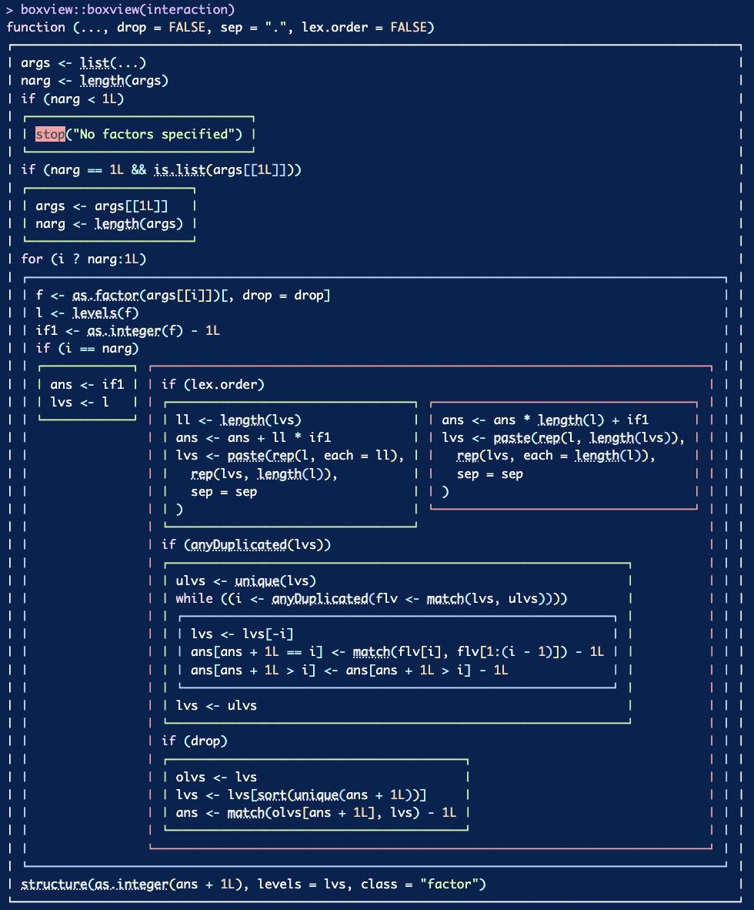

<!-- README.md is generated from README.Rmd. Please edit that file -->

# boxview 

`boxview::boxview()` displays the code of a function in nested boxes,
showing the ‘yes’ and ‘no’ clauses of `if` calls side by side. It often
makes code easier to skim than the traditional way.

## Installation

You can install the development version of boxview like so:

``` r
pak::pak("cynkra/boxview")
```

## Example

Here’s `base::interaction()` shown with boxview and in the console.




There’s also a `width` argument to adjust, and an `optimization`
argument that you might use to get a nicer output, at the cost of taking
more time.


## See also

The [flow](https://github.com/moodymudskipper/flow) package and in
particular the function `flow::flow_view()` for a somewhat comparable
way to represent functions.
